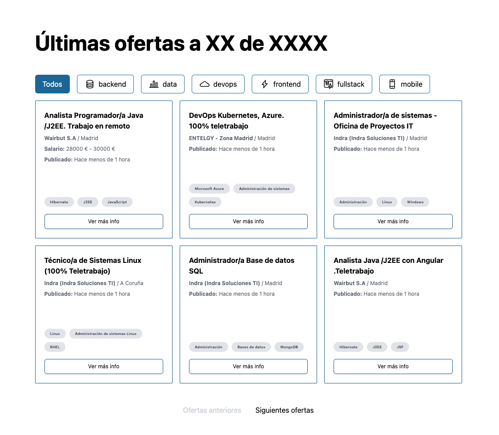
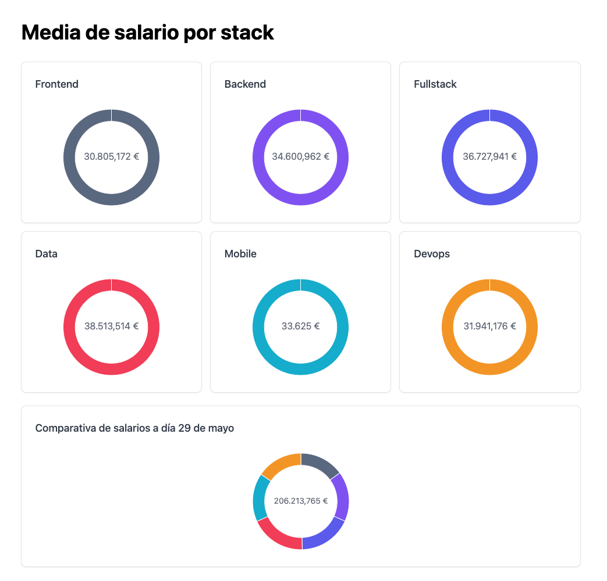
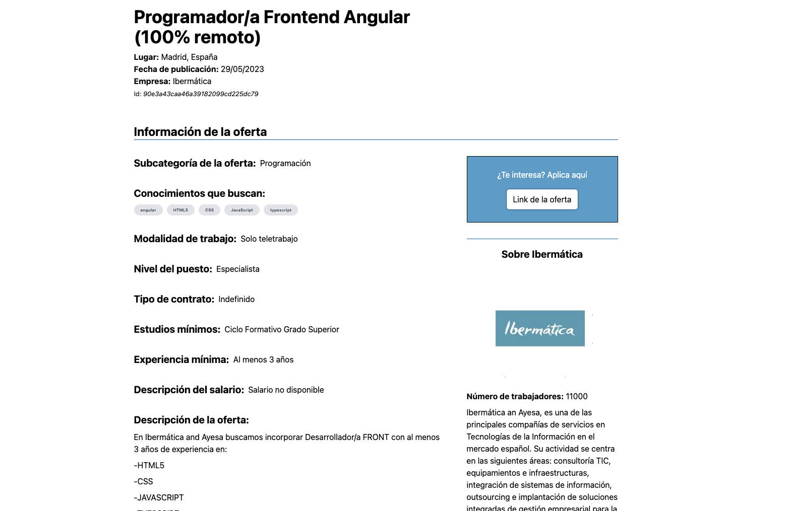

# 🖥️ Infojobs Tech

Una nueva forma de descubrir Infojobs para desarrolladores

## Por qué InfoJobs Tech

Sabemos que cuando uno busca trabajo se las tiene que ver con activar multitud de filtros para al final encontrar lo que estamos buscando. **Para el sector IT en particular, resultaba algo difícil atinar**, ya que **no existía la opción de filtrar por especialidad**.

Con InfoJobs Tech **hemos añadido ese filtro avanzado extendiendo la API de InfoJobs haciendo uso de Inteligencia Artifical**. Ahora, con esta nueva categorización, podemos filtrar con un simple click por `frontend`, `backend`, `fullstack`, `data`, `devops`, `mobile` y `otro` (el caso para montones de puestos que son del sector informático pero que no dependen de un stack en concreto).

Además, **hemos querido traer datos reales en cuanto a cómo está el mercado en la actualidad**, para que el usuario se haga una idea de en cuánto está la media de salario de su especialidad. Todo utilizando los datos de la [API de InfoJobs](https://developer.infojobs.net/).

    

También le hemos querido dar algo más de velocidad al tema de las ofertas de trabajo. Al utilizar Next.js y recoger los datos del servidor, podemos acceder a las ofertas de trabajo de una forma rápida y cómoda. Además, la pantalla de cada oferta de trabajo individual ha recibido una bocanada de aire fresco.

    

De esta forma, el usuario ve a vista de pájaro si esa oferta se ajusta a lo que está buscando.

## Deploy

Lo tienes por [aquí](https://infojobs-tech.vercel.app).

## API

La API está completamente accesible al público. Como hemos mencionado, es una versión extendida de la propia API de InfoJobs en la que ya tenemos las ofertas categorizadas por stack.

Tienes toda la documentación [aquí](https://infojobstech-api.onrender.com/api-docs/).

## Contacto

- [Xavier López](https://github.com/xavierlopez)
- [Manuel Sánchez](https://github.com/manuelsanchezweb)
